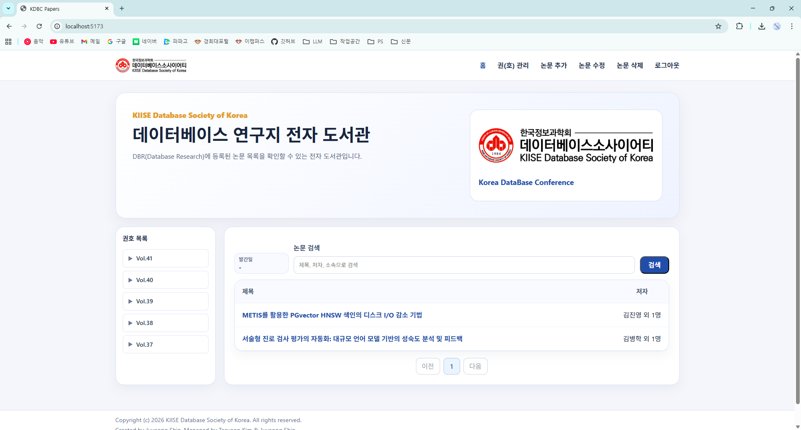

# KIISE Database Society of Korea Digital Library

## 구성

- `frontend`: React + Vite
- `backend`: Express
- `database`: SQLite

## 기능

- 메인 페이지
- 논문 목록 게시판
- 논문 상세 조회

---

## 1. WSL2 기본 설치

Ubuntu 기준:

```bash
sudo apt update
sudo apt install -y curl git build-essential sqlite3

curl -o- https://raw.githubusercontent.com/nvm-sh/nvm/v0.40.3/install.sh | bash
source ~/.bashrc
nvm install 20
nvm alias default 20
```

버전 확인:

```bash
node -v
npm -v
sqlite3 --version
```

---

## 2. SQLite 설정

DB 초기화(권장):

```bash
bash database/init_db.sh
```

---

## 3. 백엔드 실행

```bash
cd backend
npm install
npm run dev
```

기본 주소:
- `http://localhost:4000`

헬스체크:
- `http://localhost:4000/api/health`

---

## 4. 프론트엔드 실행

새 터미널:

```bash
cd frontend
npm install
npm run dev
```

기본 주소:
- `http://localhost:5173`

---

## 5. 디렉터리 구조

```text
kcc-portal/
├── backend/
│   ├── config/
│   ├── controllers/
│   ├── routes/
│   ├── .env.example
│   ├── package.json
│   └── server.js
├── database/
│   ├── init_db.sh
│   └── schema.sql
├── frontend/
│   ├── src/
│   │   ├── api/
│   │   ├── components/
│   │   ├── pages/
│   │   ├── styles/
│   │   ├── App.jsx
│   │   └── main.jsx
│   ├── index.html
│   ├── package.json
│   └── vite.config.js
└── README.md
```

---
